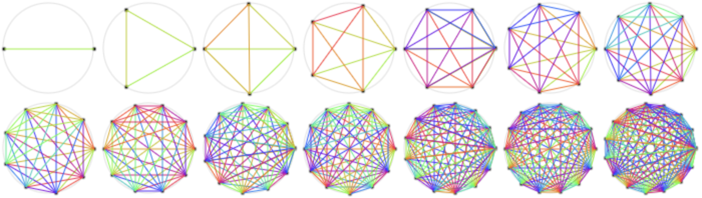

# metcalfes-law

[Animated visualization](https://pkcpkc.github.io/metcalfes-law/) of [Metcalfe's Law](https://en.wikipedia.org/wiki/Metcalfe%27s_law).

Metcalfe's Law is related to the fact that the number of unique possible connections in a network of n nodes can be expressed mathematically as the triangular number n(n-1)/2, which is asymptotically proportional to n².

Available themes:
- [🖤](https://pkcpkc.github.io/metcalfes-law/?🖤)
- [🦄](https://pkcpkc.github.io/metcalfes-law/?🦄)
- [⬜](https://pkcpkc.github.io/metcalfes-law/?⬜)

## Cite from Pascal Bornet

What does that mean for your organization and your teams?

Because of the structure of our mind, we can have tight relationships with only 5 people. Because of this, progressive organizations structure themselves as decentralized networks of teams. These networks have no (or few) middle managers. They feature highly autonomous teams where members take care of communication, coordination, and contracting themselves. 

But as Metcalfe's Law shows, when there are no managers, teams must be small enough that members do not get overloaded with communication and information

Pascal Bornet [LinkedIn](https://www.linkedin.com/feed/update/urn:li:activity:6980766334460583937?updateEntityUrn=urn%3Ali%3Afs_feedUpdate%3A%28V2%2Curn%3Ali%3Aactivity%3A6980766334460583937%29)

## Appendix

Even if there are managers, if team size get's too big, keeping the team coherence will be impossible, or in other words:
The effort required to spread information among the team members exceeds the time available to produce in far - killing the efficiency.
